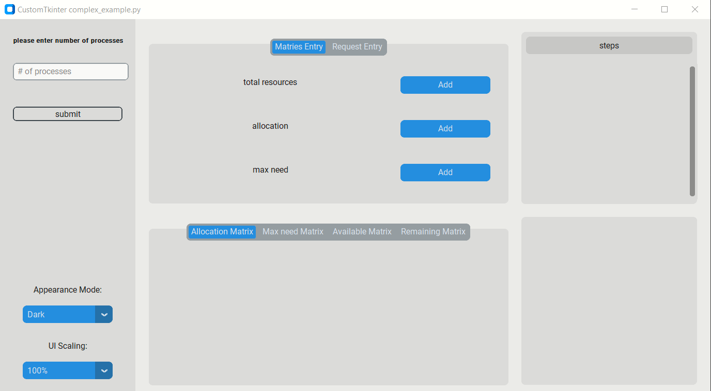
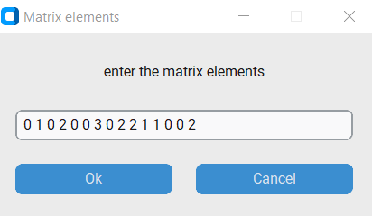
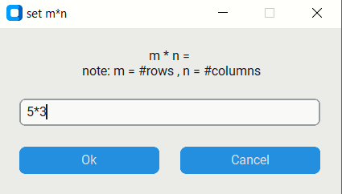

## Banker-s-algorithm-assignment3-OS
This project implements the Banker's Algorithm, a deadlock avoidance algorithm used in operating systems. It includes a GUI that allows users to visualize the algorithm in action.

## Table of Contents

  - [Banker-s-algorithm-assignment3-OS](#Banker-s-algorithm-assignment3-OS)
  - [Table of Contents](#table-of-contents)
  - [Installation](#installation)
  - [Usage](#usage)
  - [Contributing](#contributing)
  

## Installation

To run the code, you will need to have Python 3 and Tkinter installed on your system. You can install Tkinter and CustomTkinter using pip:

```bash
pip install tkinter
pip install customtkinter
```

To run the program, simply clone the repository and run the `Banker-s-algorithm-assignment3-OS.py` file:

```bash
git clone https://github.com/yourusername/Banker-s-algorithm-assignment3-OS.git
cd Banker-s-algorithm-assignment3-OS
python Banker-s-algorithm-assignment3-OS.py
```

## Usage

When you run the program, you will see a GUI with several input fields and buttons. Here's how to use it:

1. Enter the number of processes in the appropriate field and click submit.
2. for each matrix you will enter # of rows and # of columns in its input dialog "set m * n",then a message will appear to tell you how to enter the matrix elements 
3. Add the total resource matrix.
4. Add the allocation matrix.
5. Add the maximum need matrix.
6. Enter the process id 
7. Add the request matrix
8. Click the "Submit" button to run the Banker's Algorithm and see the matrices in the "matrices" tab view, the steps of the algorithm in "steps" frame
and the result of the algroithm in the "result" frame.






## Contributing

Contributions are welcome! If you find a bug or want to add a new feature, please open an issue or submit a pull request.
